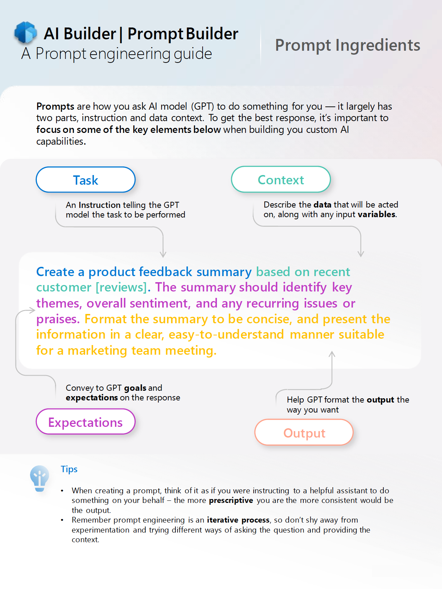

# Exercice : créer un plugin d’invite

Dans cet exercice, vous allez apprendre à effectuer les opérations suivantes :

- Comment rédiger une invite correcte
- Comment créer l’invite dans Copilot Studio
- Comment tester l’invite dans le générateur d’invites
- Comment utiliser le plugin d’invite dans Microsoft 365 Copilot

## Comment rédiger une invite correcte

Plus tôt dans ce module, vous avez déjà appris quelques notions de base de l’ingénierie d’invite. Pour en savoir plus sur l’ingénierie d’invite, le guide d’ingénierie d’invite de l’équipe d’AI Builder constitue une excellente ressource. Le guide d’ingénierie d’invite est disponible [ici](https://aka.ms/learn-ai-builder-prompting-guide).

## Éléments d’une bonne invite

Le guide d’ingénierie d’invite de l’équipe d’AI Builder dispose d’un excellent ensemble d’éléments qui doivent faire partie de votre invite.

Comme vous pouvez le voir, il contient les éléments suivants :

- **Tâche** : une **instruction** indiquant au modèle GPT (Generative Pre-trained Transformer) la tâche à effectuer.
- **Contexte** : décrivez les **données** qui sont utilisées, ainsi que toutes les **variables** d’entrée.
- **Attentes** : transmettez à GPT les **objectifs** et les **attentes** concernant la réponse.
- **Sortie** : aidez GPT à mettre en forme la **sortie** comme vous le souhaitez.



## Tâche 1 : concevoir une invite

Dans cette tâche, vous concevez une invite qui vous aide à créer un plan de développement professionnel basé sur des objectifs de carrière.

> [!IMPORTANT]
> Lors de la création d’une invite, vous n’avez pas besoin de commencer à partir de zéro. Bien qu’il soit très utile de savoir comment écrire une bonne invite, il peut être utile de commencer par quelque chose qui vous amène déjà à mi-chemin.
> Des exemples d’invite sont déjà disponibles dans la [galerie d’exemples de solutions d’adoption de Microsoft](https://aka.ms/power-prompts). Dans cet exercice, nous allons utiliser l’[exemple d’invite de plan de développement professionnel](https://adoption.microsoft.com/sample-solution-gallery/sample/pnp-powerplatform-prompts-professional-development/).

Ajoutons tous les ingrédients d’invite :

- **Tâche** : concevez un plan de développement professionnel.
- **Contexte** : pour une personne qui vise les [objectifs] de carrière suivants.
- **Attentes** : le plan doit inclure des objectifs, des ressources et des outils, ainsi qu’une chronologie des activités.
- **Sortie** : mettez en forme le plan de façon concise et exploitable et présentez les informations de manière claire et facile à suivre pour un employé de niveau junior.

Ensemble, il s’agirait de l’invite suivante :

*Concevez un plan de développement professionnel pour une personne qui vise les [objectifs] de carrière suivants. Le plan doit inclure des objectifs, des ressources et des outils, ainsi qu’une chronologie des activités. Mettez en forme le plan de façon concise et exploitable et présentez les informations de manière claire et facile à suivre pour un employé de niveau junior.*

## Tâche 2 : créer une action d’invite dans Copilot Studio

Maintenant que vous avez terminé d’écrire l’invite, il est temps de l’entrer dans Copilot Studio.

1. Dans votre navigateur web, accédez à [Copilot Studio](https://copilotstudio.microsoft.com) et connectez-vous avec votre compte professionnel ou scolaire, si vous y êtes invité.  Sélectionnez **Ignorer** pour ignorer les messages d’accueil.

    **Remarque :** la première fois que vous ouvrez Copilot Studio, il peut afficher une interface de conversation pour créer votre premier copilote. Si cela se produit, sélectionnez le menu **...** en haut à droite (en regard du bouton **Créer**), puis sélectionnez **Annuler la création du copilote**, puis **quittez** l’interface de conversation et affichez la page d’accueil de Copilot Studio.
1. Sélectionnez **Bibliothèque** dans le volet de navigation de gauche. Ici, vous pouvez afficher une liste d’actions et de connecteurs existants et en créer.
1. Sélectionnez **Ajouter un élément** en haut.  Un menu répertorie 2 options d’extension de Copilot pour Microsoft 365.
:::image type="content" source="../Media/extend copilot options.png" alt-text="La fenêtre répertorie 2 options d’extension de Copilot : créer un copilote ou créer une action.":::
1. Sélectionnez **Nouvelle action**.
1. Dans l’écran *Nouvelle action*, sélectionnez **Invite**. Cela ouvre le générateur d’invites AI Builder.
1. Dans la page **Détails de l’action**, entrez « Plan de développement professionnel » comme **nom d’action**.
1. Entrez la **description** suivante : « Crée un plan de développement professionnel exploitable en fonction des objectifs de carrière souhaités ».
1. Cliquez sur **Suivant**.
1. Dans la section d’**invite** de la page **Ajouter une action d’invite**, entrez « Concevez un plan de développement professionnel pour une personne qui vise les [objectifs] de carrière suivants. Le plan doit inclure des objectifs, des ressources et des outils, ainsi qu’une chronologie des activités. Mettez en forme le plan de façon concise et exploitable et présentez les informations de manière claire et facile à suivre pour un employé de niveau junior. » comme **invite**.

    > [!NOTE]
    > Notez qu’il existe une barre d’informations en haut qui indique que votre invite doit comporter au moins une valeur dynamique.

1. Sous **Paramètres d’invite** dans la barre latérale droite, ouvrez la section **Entrée**.
1. Sélectionnez le bouton **Ajouter une entrée** pour ajouter une entrée.
1. Saisissez `milestones` comme nom d’entrée.
1. Ajoutez le texte suivant comme exemple de données :

      ```text
      * Become medior in 3 years
      * Have 3 top reviews in a row
      * Become a manager in 10 years
      ```

1. Sélectionnez **[objectifs]** dans la section d’invite avec votre curseur.
1. Sélectionnez **Insérer**.
1. Sélectionnez les **objectifs**.

      Cela modifie les **[objectifs]** en une valeur dynamique.

1. Ensuite, nous sommes prêts à tester notre invite.

## Tâche 3 : tester l’invite dans le générateur d’invites

1. Sélectionnez **Tester l’invite** sous la section d’invite. Cette opération teste l’invite avec les exemples de données que vous avez ajoutés précédemment.

    > [!NOTE]
    > L’invite est envoyée au modèle IA et la réponse est affichée dans la section de réponse IA. Cela vous permet de voir comment le LLM répond et de voir si vous êtes satisfait des résultats.

1. Lorsque vous êtes satisfait de la réponse IA, sélectionnez **Enregistrer une invite personnalisée** pour enregistrer l’invite.

    Dans la fenêtre suivante, vous pouvez passer en revue la description du plug-in et la description des entrées.

1. Dans la page **Sélectionner les paramètres d’action**, remplacez la description des entrées des **objectifs** par :

      ```text
      The career milestones that the user wants to achieve
      ```

1. Cliquez sur **Suivant**.

1. Sélectionnez **Publier** pour publier votre action sur Microsoft 365 Copilot.  Cela peut prendre une minute.

## Tâche 4 : utiliser le plug-in d’invite dans Microsoft 365 Copilot

Maintenant que vous avez créé votre action d’invite et l’avez testée, passez à la tâche suivante pour y accéder dans Microsoft 365 Copilot.  L’affichage de votre plug-in dans Microsoft 365 Copilot peut prendre 5 minutes ou plus.

1. Ouvrez [Microsoft Teams](https://teams.microsoft.com).
1. Sélectionnez le bouton **Copilot** dans la barre de navigation de gauche.
1. Sélectionnez l’icône **Gérer la réponse de Copilot** en bas de l’écran (en regard de l’emplacement où vous pouvez envoyer des messages à Copilot).
1. Recherchez **Copilot Studio** dans le menu volant qui s’affiche et vérifiez qu’il est activé.  
1. Sélectionnez l’**icône d’insertion** pour développer la liste des actions sous Copilot Studio.

    > [!NOTE]
    > Il se peut que Copilot Studio ne soit pas visible. Il peut y avoir deux raisons à cela : votre administrateur n’a pas déployé l’application intégrée Copilot Studio ou le plug-in n’a pas encore indexé, et cela peut signifier que vous devriez attendre un peu plus longtemps.

2. Recherchez l’action **Plan de développement professionnel** dans la liste des actions sous la section Copilot Studio, puis sélectionnez le bouton bascule en regard de celle-ci pour l’activer.

    > [!NOTE]
    > Si vous ne voyez pas le plan de développement professionnel dans la liste des plug-ins sous Copilot Studio, il se pourrait qu’il mette plus de temps à s’afficher. L’affichage dans Microsoft 365 Copilot peut prendre un peu plus de temps.

3. Après avoir activé l’action Plan de développement professionnel, vous pouvez désormais l’utiliser dans Copilot. **Essayez-la** en envoyant le message suivant à Copilot dans Teams : « J’aimerais générer un plan de développement professionnel pour atteindre les objectifs de carrière suivants : 1 - devenir meilleur dans mon travail en tant que responsable marketing et 2 - avoir plus de chances d’être promu au poste de responsable marketing senior. »

**Conseil :** pour activer le mode développeur dans Copilot, entrez `-developer on` dans la conversation.  Cela vous permet d’observer quand Copilot a utilisé un plug-in pour répondre dans la conversation.
